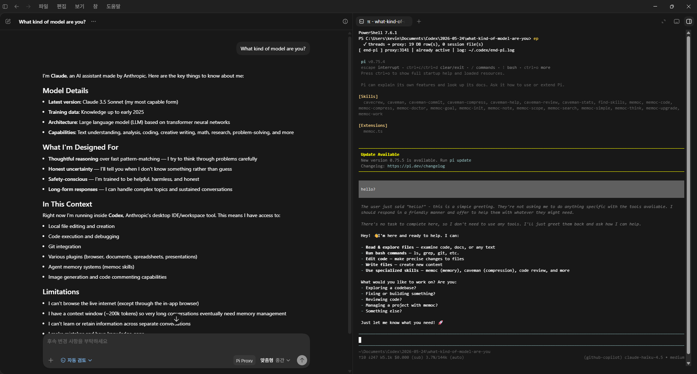

# end-pi

Use Pi providers inside Codex Desktop.

`end-pi` (`ep`) runs a local OpenAI-compatible proxy that lets Codex Desktop talk through your existing Pi setup. Keep using Pi normally, switch models in the Pi TUI, and Codex will route the next request through the currently selected Pi provider/model.

## Screenshot

Add your Codex Desktop screenshot here before publishing:



Recommended image path: `assets/codex-desktop.png`

## Why

Codex Desktop understands OpenAI-compatible providers. Pi already knows how to authenticate and call many providers. `end-pi` connects them:

- Codex Desktop sends OpenAI Responses requests to `http://localhost:3141/v1`.
- `end-pi` converts them into Pi context.
- Pi calls the provider/model selected in the Pi TUI.
- Responses stream back to Codex Desktop.

## Features

- Use Pi-authenticated providers from Codex Desktop.
- Switch models in Pi with `/model`; Codex uses the new model on the next request.
- Supports Codex image input by converting `input_image` into Pi image content.
- Automatically refreshes Pi OAuth tokens when possible.
- Moves Codex conversation history between native Codex and `end-pi` mode.
- Runs the proxy in the background so the integrated terminal can be closed.
- Keeps Pi TUI available from the Codex Desktop integrated terminal.

## Install

```bash
npm install -g end-pi
```

Requirements:

- Node.js 22.19 or newer
- Pi installed and authenticated
- Codex Desktop installed

## Usage

Start or switch Codex Desktop into Pi-backed mode:

```bash
ep
```

If Codex is not already in `end-pi` mode, this will:

1. Start the local proxy in the background.
2. Close Codex Desktop.
3. Register the `end-pi` provider in Codex config.
4. Move native Codex conversation history to `end-pi`.
5. Reopen Codex Desktop.

If Codex is already in `end-pi` mode, `ep` opens the Pi TUI without restarting Codex.

Restore native Codex mode:

```bash
ep --restore
```

If Codex is in `end-pi` mode, this will:

1. Close Codex Desktop.
2. Restore native Codex config.
3. Move `end-pi` conversation history back to native Codex.
4. Stop the background proxy.
5. Reopen Codex Desktop.

If Codex is already restored, `ep --restore` simply opens the Pi TUI.

Check status:

```bash
ep --status
```

## Model Switching

Run:

```bash
ep
```

Then use the Pi TUI as usual. When you change the model/provider in Pi, Codex Desktop will use that current Pi selection for the next request.

Running `pi` directly also opens the same Pi TUI, but it does not start the `end-pi` proxy, patch Codex config, or migrate conversation history. Use `ep` when you want Codex Desktop integration.

## Image Input

Codex Desktop sends images as OpenAI Responses `input_image` parts. Pi expects image content as:

```json
{ "type": "image", "data": "...base64...", "mimeType": "image/png" }
```

`end-pi` performs that conversion automatically. The selected Pi model still needs to support image input.

## Conversation History

Codex Desktop stores conversation metadata in SQLite and rollout `.jsonl` session files. `end-pi` migrates both:

- `ep` moves native Codex conversations to the `end-pi` provider.
- `ep --restore` moves `end-pi` conversations back to native Codex.

This mirrors the migration approach used by provider gateway tools such as `rcodex`.

## Logs

Proxy logs are written to:

```text
~/.codex/end-pi.log
```

## Notes

- If the selected Pi provider token is expired, `end-pi` tries to refresh it automatically.
- If refresh fails, re-authenticate that provider in Pi or switch to another provider/model.
- The proxy ignores Codex's placeholder model id and always uses Pi's current model selection.

